# Deploying The Client Using AWS Amplify
Amplify is an Amazon service which gives Developers the ability to quickly deploy an application to the cloud without having worry about complex configuration and the management of cloud resources. For the Client (Frontend), this is as simple as clicking through a number of forms and connecting your GitHub account with your AWS account and selecting a code repository. Amplify can also be used for the API (Backend) by relying on serverless technologies as well as GraphQL, but is beyond the scope of this project. 

You can find more information at the [Amplify Product Page](https://aws.amazon.com/amplify/).

## Getting Started
1) Set up your AWS account. You should have received that information from a member of the Hack team.

2) Set up your GitHub account. If you're reading this, there is a good chance that you have already done that. 

3) Fork this repository under your team or personal account.

4) Please deploy the Backend API component of your app before deploying the Frontend. You will need the URL to your API.

## Configuring Automated Deployments
A deployment is pushing a version of your frontend application to an environment (developmernt, production, etc...). This version of your application is usually available to your end users, in this case it will be publicly available on the internet. 
By following the steps below, your code will be built and automatically deployed to AWS Amplify and updated any time you merge or commit to the `master` branch.

**Overview**

To achieve Continuous Deployments(CD), you will be linking your AWS Amplify application profile with your GitHub repository. Then you will perform some configuration steps and have a CD enabled Frontend App!

*note that AWS updates icons and styles change over time  so the screenshots may be outdated* Please open an issue to let us know.

### 1)
First you will login into your AWS Console and be presented with the landing page / Dashboard.

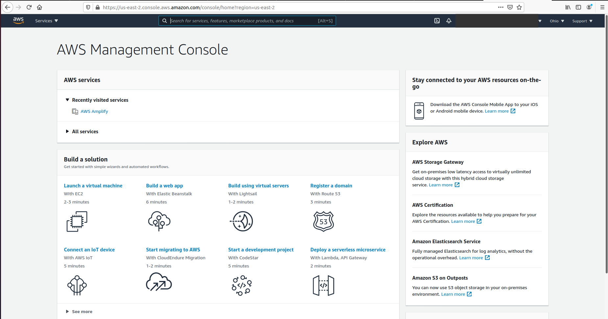
 
 

### 2) 
Next click the search bar at the top of the page and search for "amplify". Select the "AWS Amplify" service in the results 

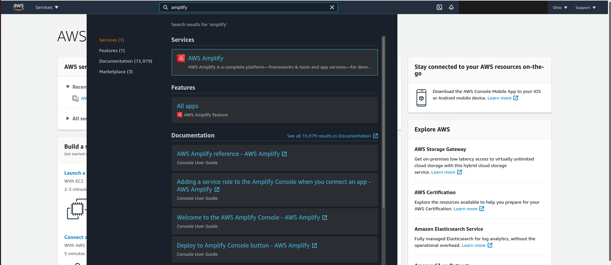
 
 

#### 3)
You should be presented with the Amplify service landing page.

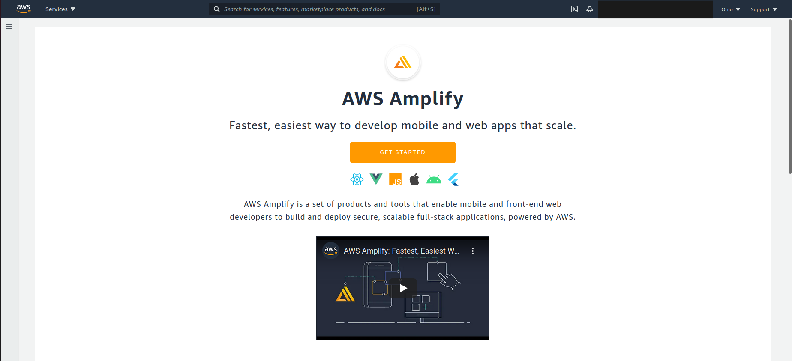
 
 

#### 4)
Please click the hamburger button on the top left (triple lines). Then select "All apps".

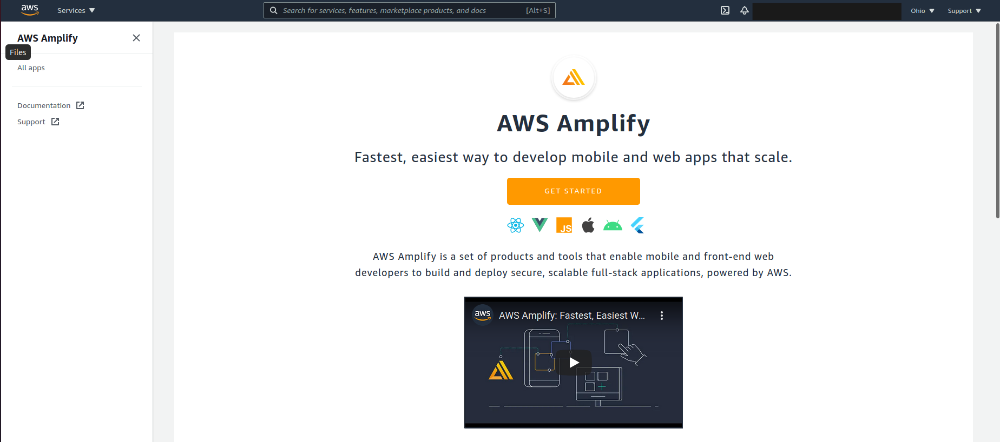
 
 

#### 5)
Click "new app" and then select "Host web app" from the dropdown menu.

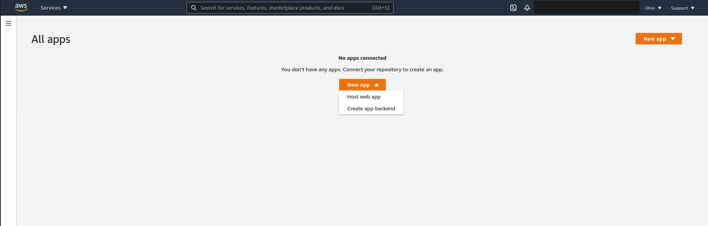
 
 

#### 6)
You should be presented with a "Host your web app" page with many different code repository providers. Select "GitHub" and then click "Continue".

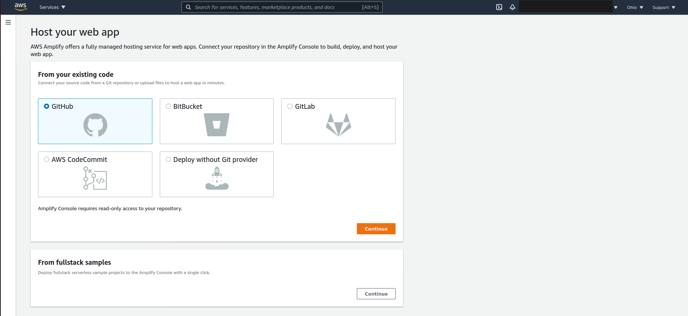
 
 

#### 7)
A new tab or window will open and prompt you to authorize access to your GitHub account from your AWS Amplify account. Click "Grant" next to "Hack-Diversity" and then click the "Authorize aws-amplify-console" button.

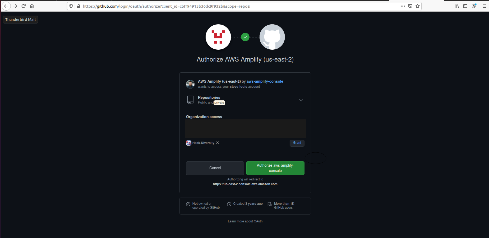
 
 

#### 8) 
Select your repository from the list (other Hack.Diversity repositories may be available) and target branch (should be `master`). Also, make sure to check the "Connecting a monorepo? Pick a folder." button and enter `client` for the folder name.

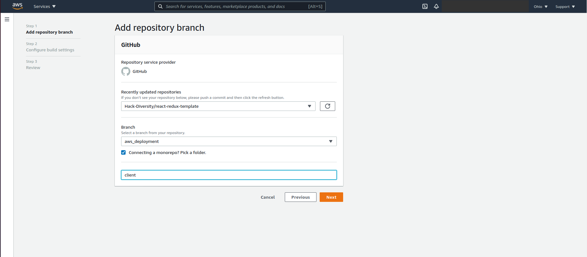
 
 

#### 9)
On this next screen you will be configuring your build settings. 
Give your app an name. We recommend using your team number or a team name.
##### A.
This repository contains an `amplify.yml` file within the root folder which will override the defaults defined on this page. But please look over the defaults and the `amplify.yml` file to get an idea of the deployment steps.

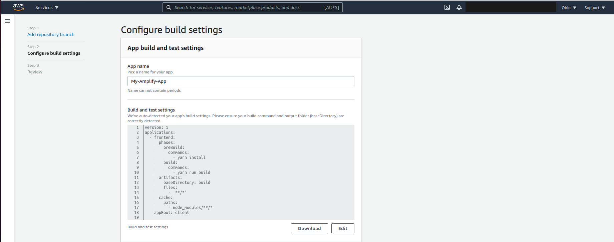
 
 

##### B.
Click "Advance Settings" and scroll to the bottom of the page and look at the "Environment Variables" section. You will need to enter the following variables:

| Key | Value |
|---|---|
| REACT_APP_API_URL | The URL of your Backend API from Beanstalk or AWS Route 53 |
|  REACT_APP_API_HOSTNAME | The URL of your domain name. Necessary only if you configure Route 53 | 
 
 

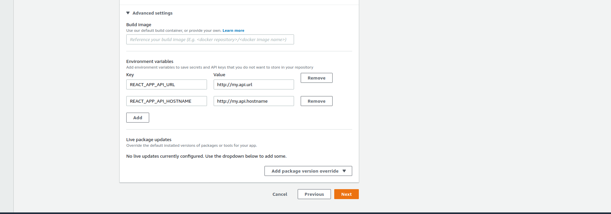
 
 

#### 10)
Review the settings for any mistakes and then click "Save and Deploy". This will deploy your app to Amplify and display your build and deployment status.

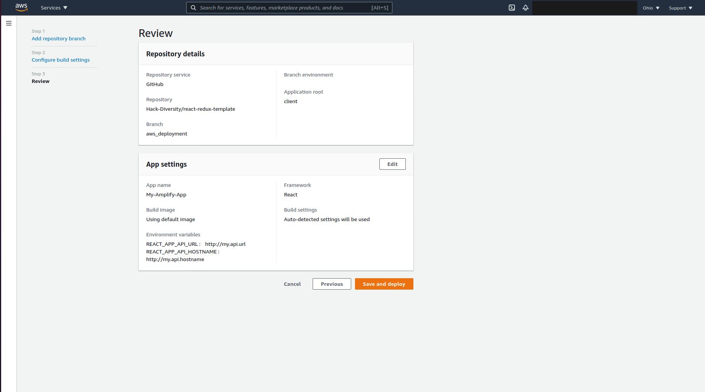
 
 

#### 11)
Once your app has successfully been deployed, you will now be able to view your Frontend/Site at the link under your Amplify environment. 

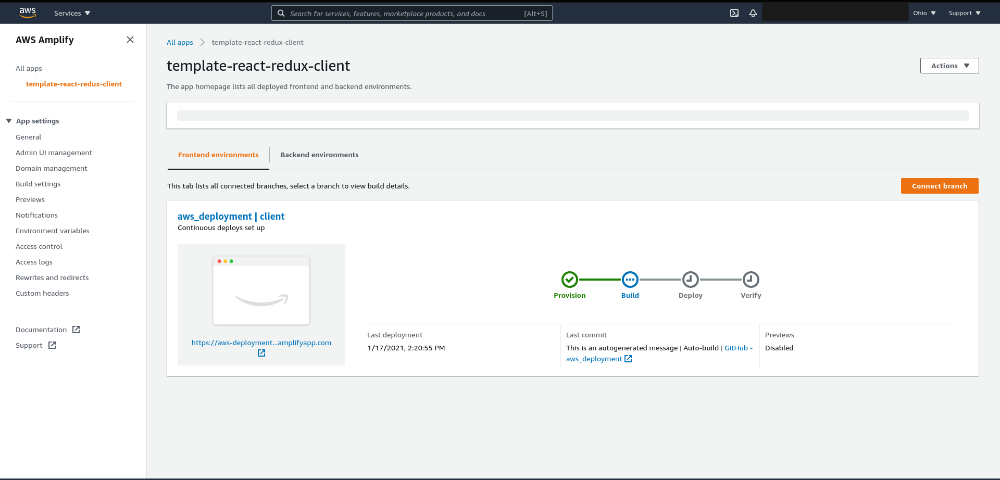
 
 

### Conclusion
Now that your app has been deployed to AWS Amplify, you will be able to view your app over the internet and share it with others. Please explore the Amplify dashboard for other neat features. Also, do remember to open an issue on this repository if you find any mistakes with these instructions.
