# Configuring MongoDB

After deploying your application to AWS you will need to access your MongoDB server so that you can import your database data. First you will need to add an entry in the Security Group which can be thought as a Firewall rule and then retrieving the MongoDB credentials from the logs.

One of the easiest ways to access and manage a Mongo database is to use [MongoDB Compass](https://www.mongodb.com/try/download/compass). Download and install it and follow the instructions down below.

## Getting MongoDB Credentials

First, you will be getting your MongoDB username and password. The server imaged used to create this database server .

Follow the [instrcutions](https://docs.bitnami.com/aws/faq/get-started/find-credentials/#option-1-find-password-by-checking-the-system-log-on-the-aws-cloud-console-ec2) to learn how you can retrieve those credentials. Make sure to save that information for now. It will be necessary for later steps.

## Getting MongoDB IPs
Your MongoDB server will have two IPs. A Private one used to access it within your Virtual Private Cloud (VPC) network. The other is a Public one used to access it over the internet.

<br>
1) Make you r way to the EC2 dashboard by typing "EC2" in the search bar and selecting "EC2". You will be presented with the EC2 dashboard.

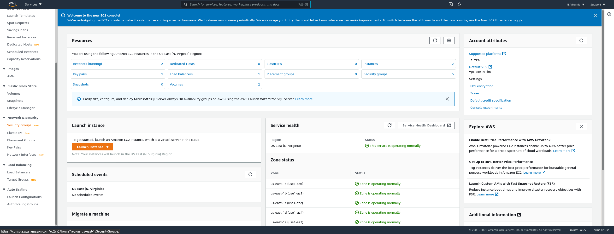


<br>
2) Click on the "Instances" link to view all of your current EC2 instances.

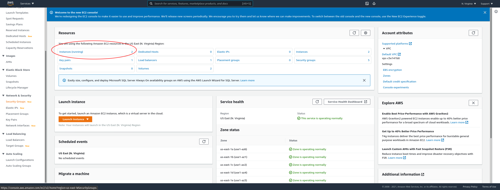


<br>
3) On this screen you will see all of your instances. There should only be two at the moment. One for MongoDB and one for Elastic Beanstalk.

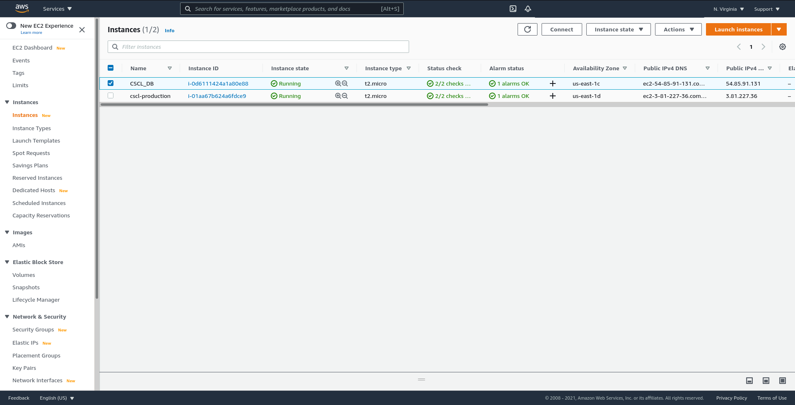


<br>
4) To the right you should see the Public IP address for your MongoDB instance. Look at the instance named "CSCL_DB". Do note this Public IP address.

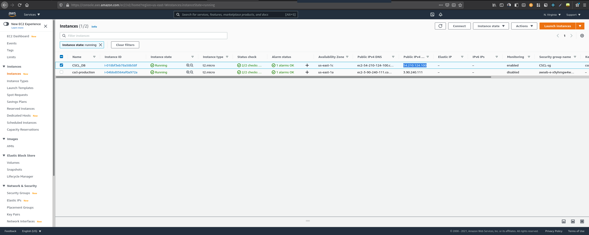


<br>
5) Click on the "Instance ID" of the "CSCL_DB" instance to go to the Instance Profile screen. Here you will see lots of information about your instance, including monitoring metrics. Do note the Private IP address.

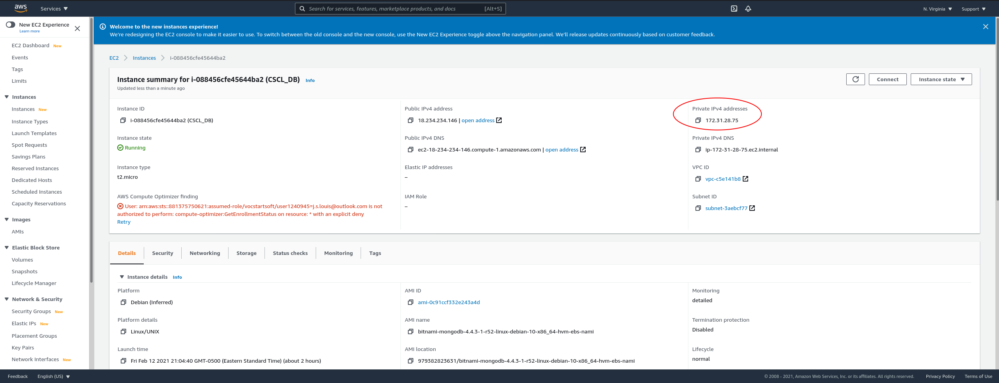

## Granting Access to MongoDB Server From Current IP
Now that you have the IP addresses of your MongoDB server. You will need to open up a port so that you can access it from your local machine.

<br>
1) First you will need to click the "Security Group" link in the left-side menu.

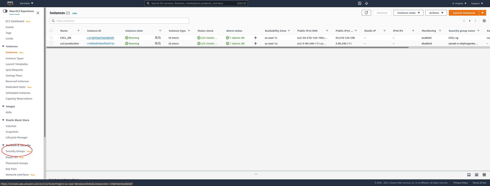


<br>
2) On this screen you will see all of your current Security Groups. Locate the one with a description of "Lock MongoDB down to webserver access" and click the "Security Group ID" link.

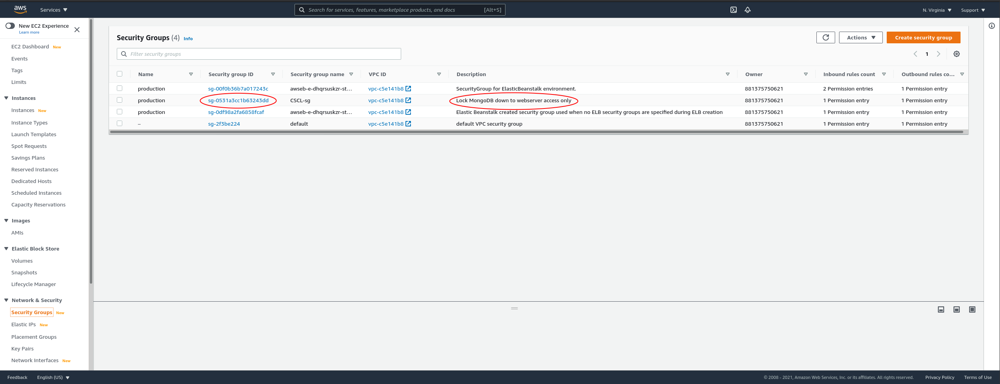


<br>
3) On this screen you will see information about the Security Group associated with the MongoDB server. You should only see a single Inbound rule and an unrestricted Outbound rule. Click the "Edit Inbound Rule" button.

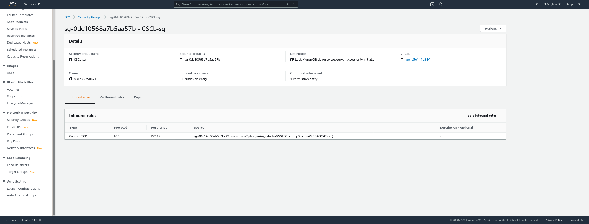


<br>
4) On this screen you will be able to add and remove rules. You will only need to add a single rule to grant yourself access to the Mongo Server.

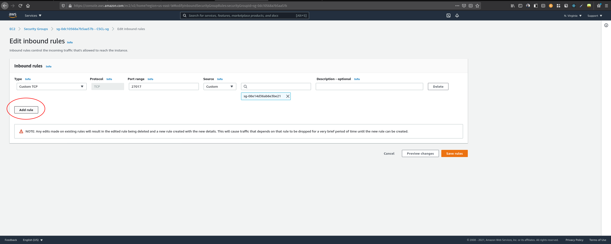


<br>
5) For the Type select "Custom TCP". For the "Port Range" enter "27017". For the source, select "My IP" which should populate the next field with your current IP address. Feel free to add a description if you wish.

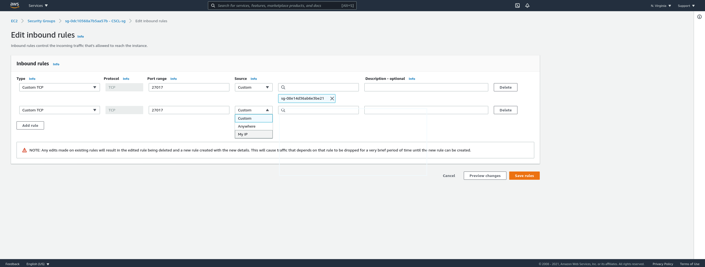


<br>
6) Once your new rule has been added, click "Save Rules"

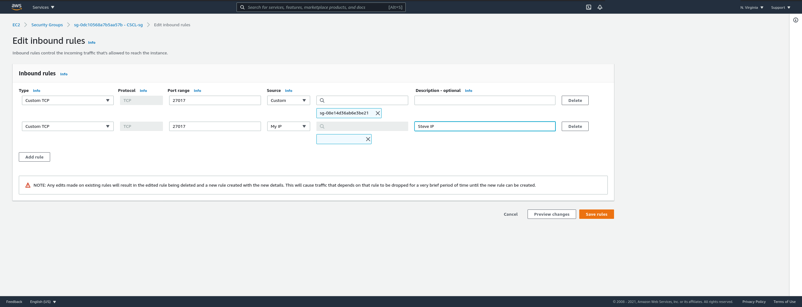


<br>
7) You will be taken to the Secrurity Group page where you can review all the Inbound rules again.

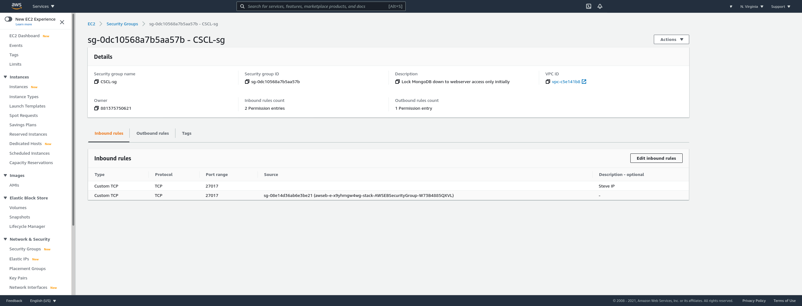


<br>
At this point, your MongoDB server will be accessible from your current IP address and the Elastic Beanstalk server. If you are using a VPN or public IP, remember to remove access as soon as you are done.

## Constructing the MongoDB Connection String

Now that we have the database credentials, the private and public ip address of your MongoDB server, you can create the connection strings. Use the following template to construct your connection strings, one will be used to access the database from your local machine and the other from the EB server.

Public Connection String:
```
mongodb://<username>:<password>@<publicIP>/admin
```

Private Connection String (used by your backend server):
```
mongodb://<username>:<password>@<privateIp>/cscl?authSource=admin
```
*Note that "cscl" in the Private connection string is the name of your database. Update the connection string accordingly if you are using a different database.*

## Connecting to MongoDB Using MongoDB Compass and Importing Your Data
Now that you have network access to the database, you can use MongoDB Compass to connect to it and import your data.

<br>
1)  In MongoDB Compass click "New Connection" and enter the "Public Connection String" you created earlier in the text field then click "CONNECT".

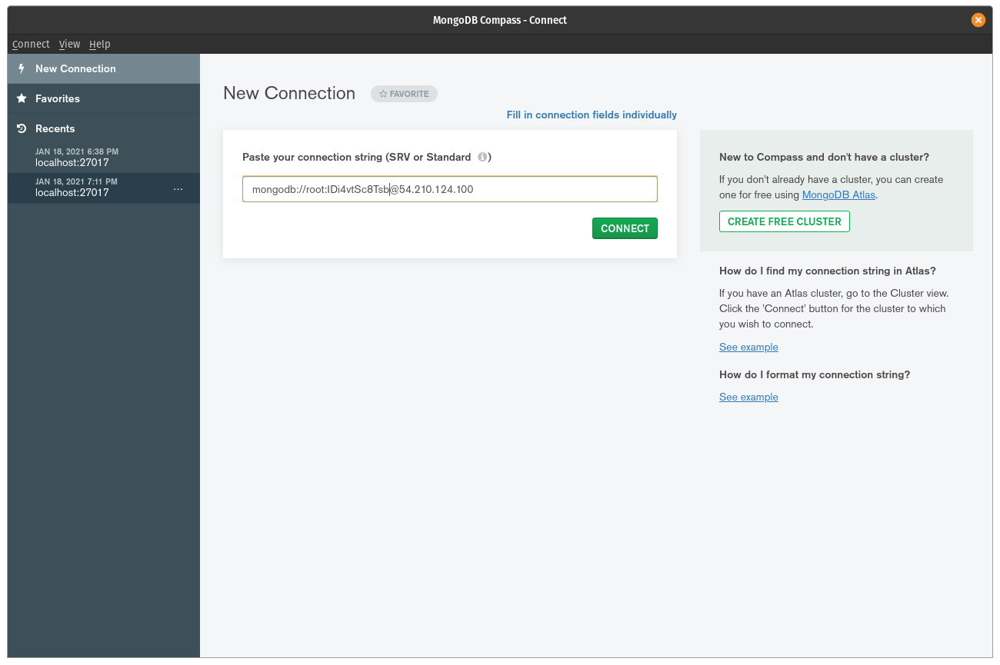


<br>
2) Once logged in you will be presented with the current databases on your MongoDB server. Click the "CREATE DATABASE" button at the top to create a new database.

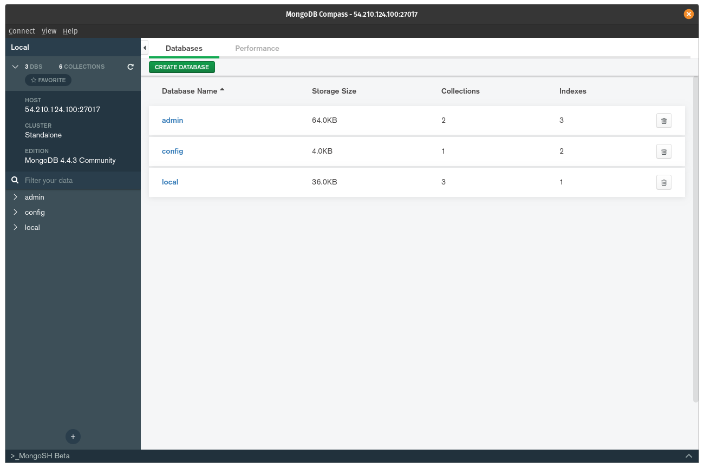


<br>
3) On this form, enter the desired database name. For these instructions "cscl" will be used for the database. "items" will be used for the collection name. Click "Create Database" once done. 

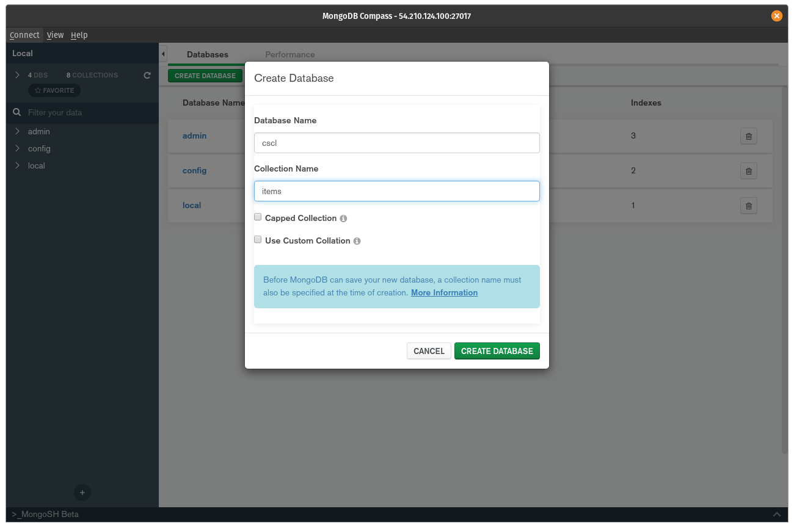


<br>
4) Once your database is created you will be presented with the list of all databases. Select the database you created, i.e. "cscl". 

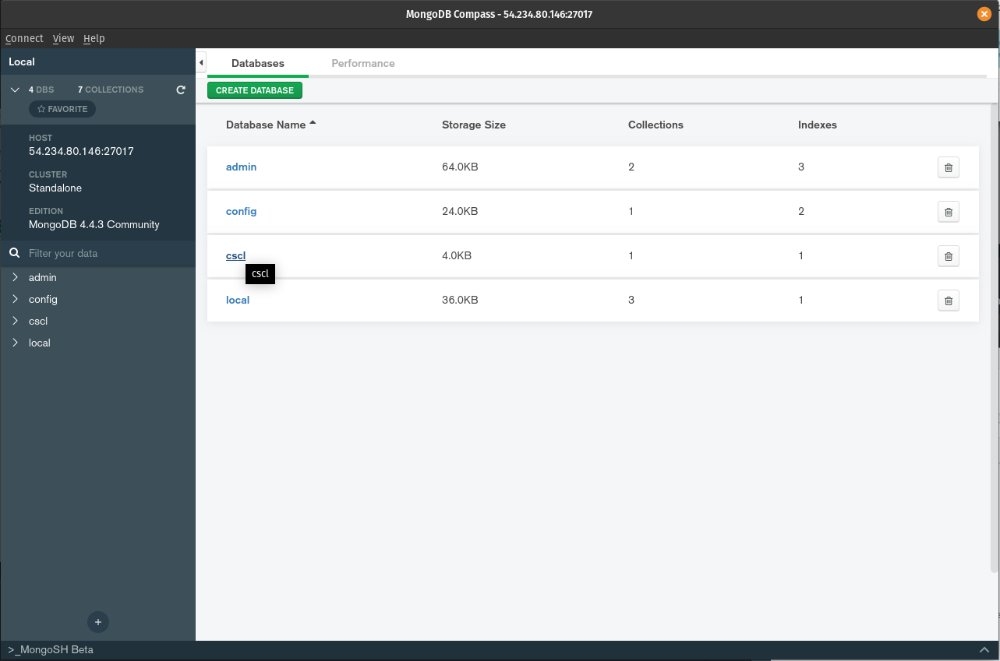


<br>
5) Select the collection that you created under your database, i.e. "items"

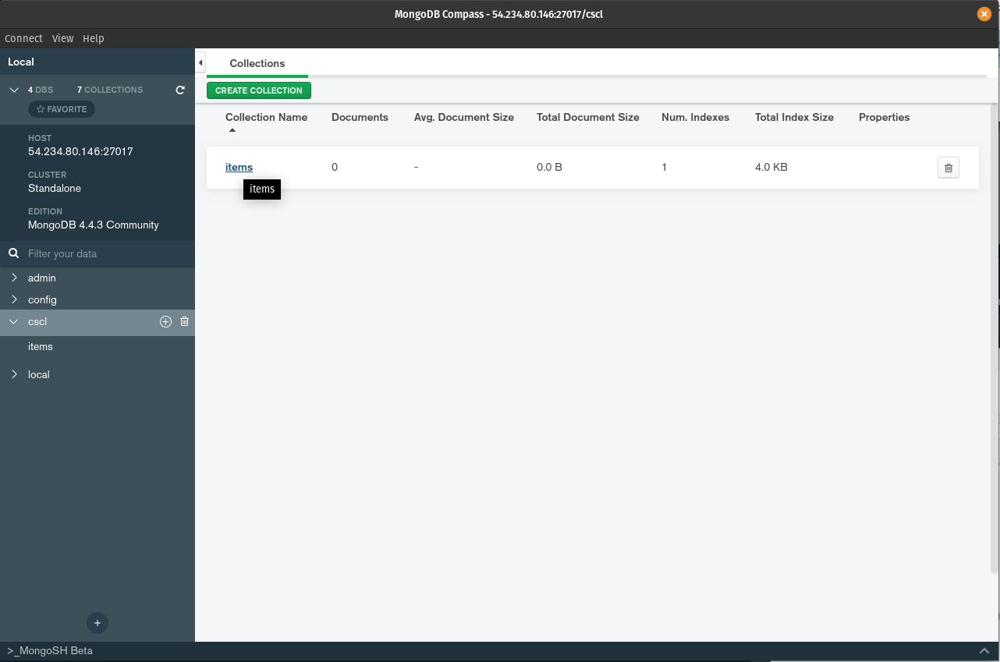


<br>
6) Click the "ADD DATA" button in the upper-left, and select "Import File".

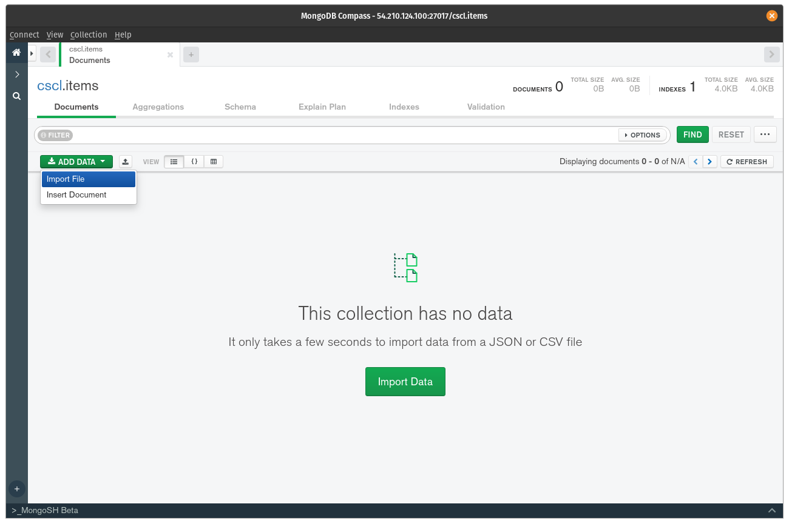


<br>
7) Select the JSON file provided to you in the [template repository](https://github.com/Hack-Diversity/template-mini-project-db) or your own MongoDB backup. Enable the Options that you would like, and click "IMPORT".

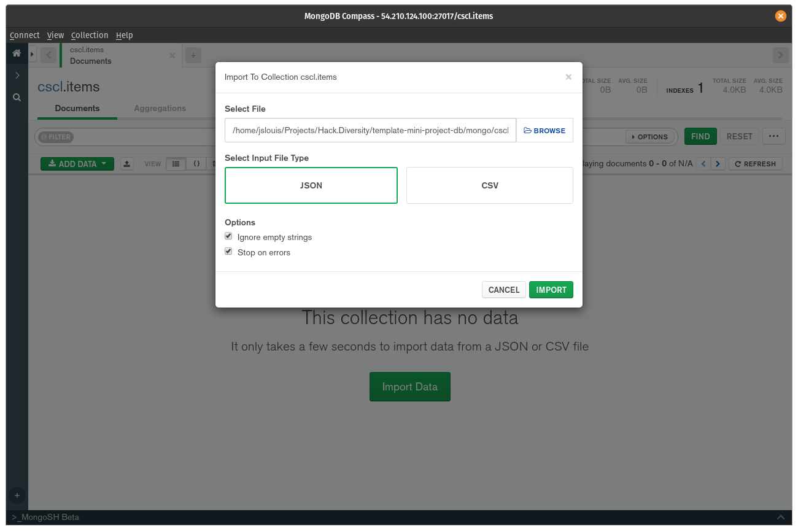

---
Congrats! You now have loaded data into your Mongo database in the cloud. Feel free to remove your IP address entry from the Security Group to remove access to your Database server.

Next: [Connecting the Backend to MongoDB](../04_Connecting_Backend_to_Mongo)
