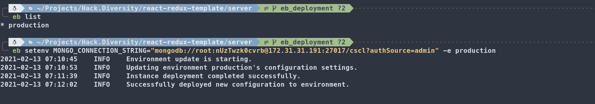

# Connecting The Backend to MongoDB
You will now update your backend server so it will be able to connect to the MongoDB server. This will be achieved by providing a connection string using an Environment Variable.
Here is an helpful [video](https://www.youtube.com/watch?v=ADh_OFBfdEE) explaining what Environment Variables are.

## Updating Your Backend Environment

Retrieve the Private IP connection string you created in the previous sections. Make sure that you are in the "server" directory and use the `eb  setenv` command to update your backend server's environment variables. Note that you can use `eb list` to view the available environments.

The format is:
```
MONGO_CONNECTION_STRING=<PRIVATE_CONNECTION_STRING> -e <EB_ENVIRONMENT>
```



---

Once deployed, your backend server will be able to connect to your MongoDB Database.

Next: [Wrapping Up](../05_Wrapping_Up/README.md)
