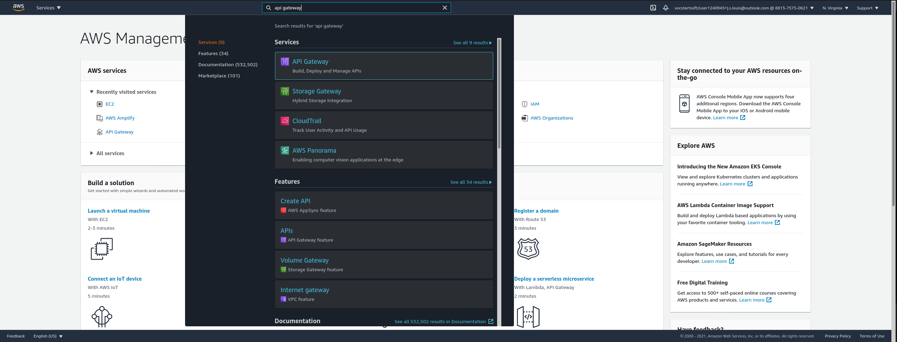
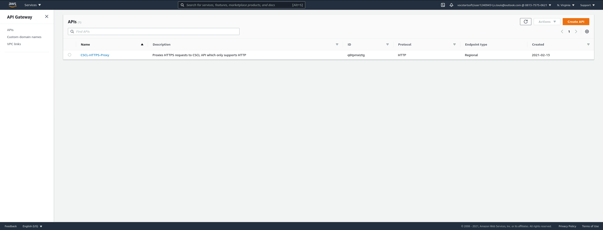
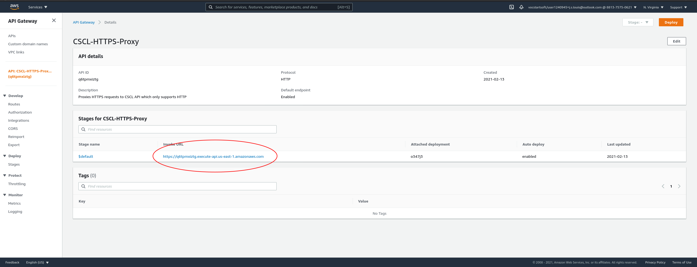
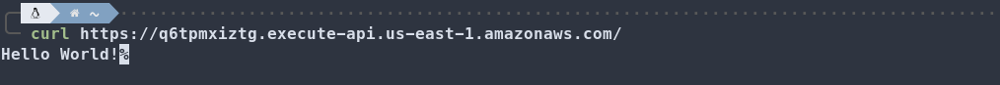
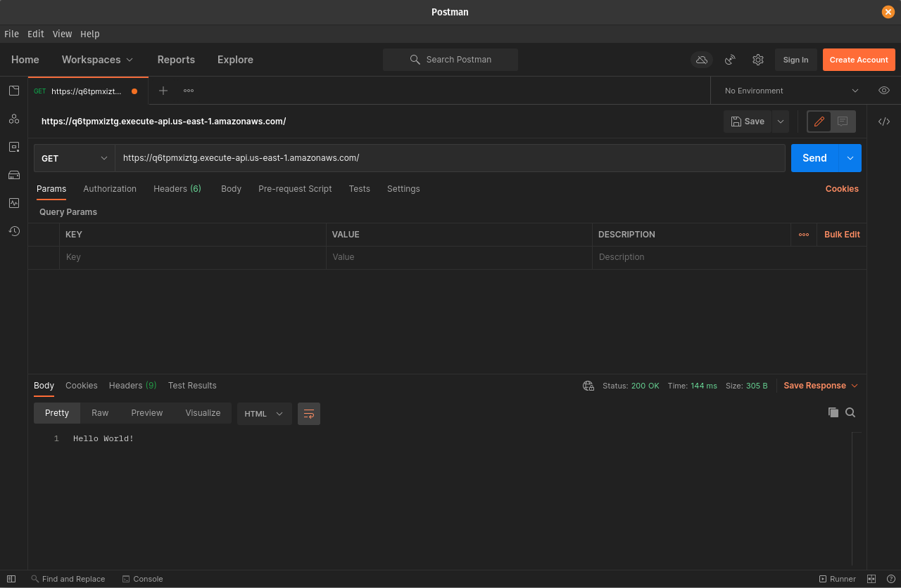
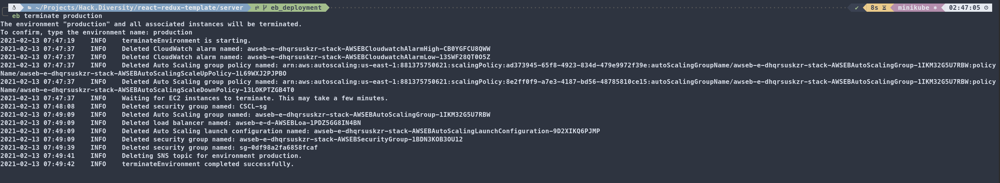

# Wrapping UP
Congrats for making it this far, you're almost all set up and ready to fully deploy your app. You will now be retrieving your backend's Gateway URL which will be used in your Frontend environment to fetch, create and update data using your API.

## Getting Your API URL
 
1) In the AWS console, search for "API Gateway" and click "API Gateway".

 
2) You should only see a single API called "CSCL-HTTPS-Proxy". Click the link to view the configuration.

 
3) On this screen, you will see your API Gateway's URL. This is the URL that will be used to access your API in Elastic Beanstalk.

## Testing
Now that you have the URL you can test it by copying it to your browser and pressing enter. You should see the response from the root (`/`) route of your API. 
Also, you can test using Curl or Postman

Curl) 

Postman)

## What's Next

To delete all resources created by your deployment, run the `eb terminate <environment>` command.

---

Next up is to create your frontend using AWS Amplify. Make sure to note the API Gateway URL because it will be used in the Frontend deployment.

[Amplify Deployment Documentation](../../amplify/README.md)

